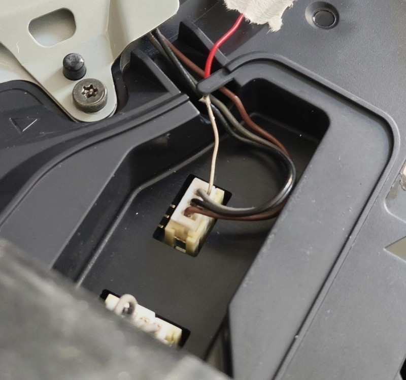
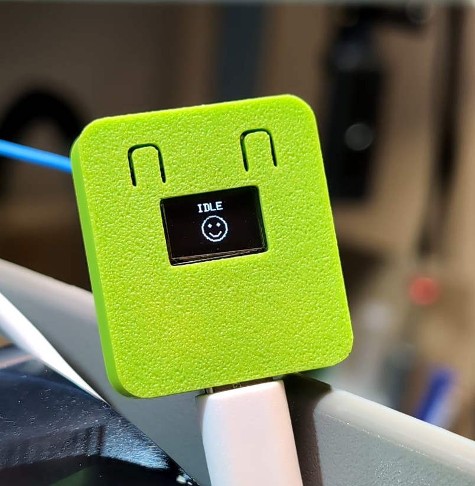
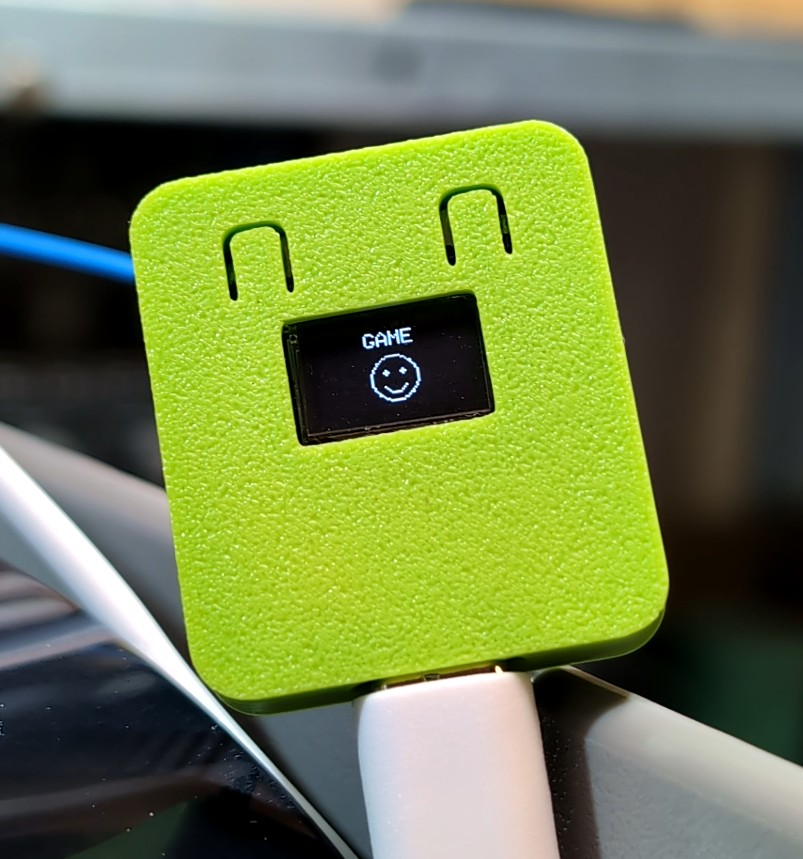
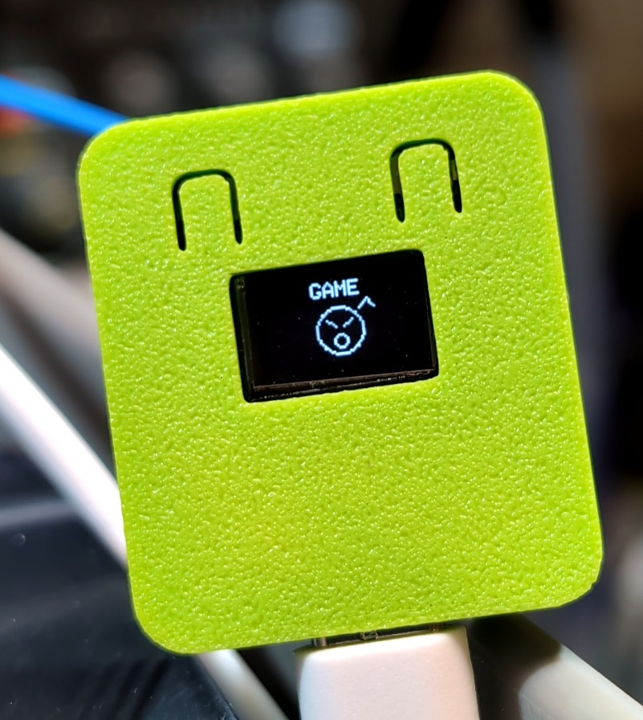
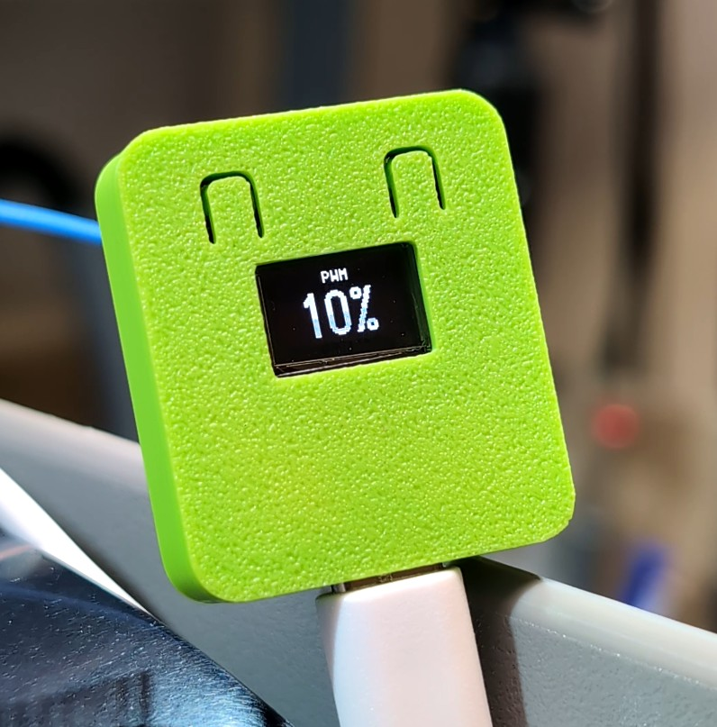
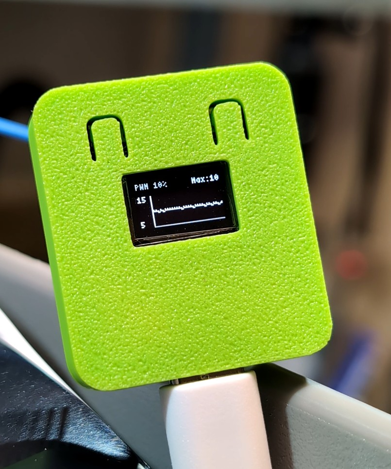
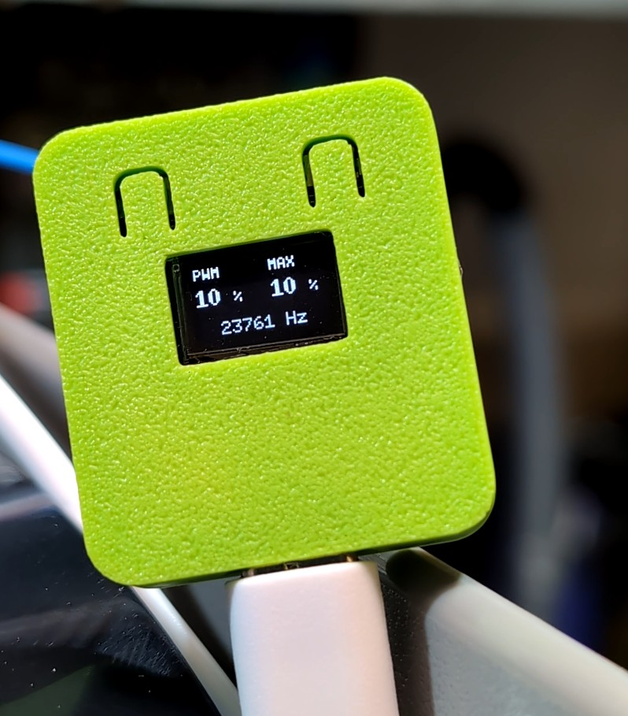

# PS5 Fan PWM Reader - ESP32-C3 OLED

Projet permettant de lire le signal PWM du ventilateur d'une PS5 avec un ESP32-C3 équipé d'un écran OLED I2C 72×40 (ESP32-EGG).
Il suffit d'alimenter le boîtier en USB, puis de relier l'entrée PWM (GPIO2) au connecteur PWM du ventilateur de la PS5 (fil gris sur ventilateur 3 broches).

Testé uniquement sur un ventilateur PS5 à 3 broches.
<p align="center">
  
</p>

Après plusieurs relevés, j'ai constaté que la PS5 fonctionne avec une ventilation d'environ **10 %** dans les menus et **19 %** en jeu (PS4 ou PS5).

On peut donc en déduire que :
* entre **10 % et 19 %**, la console ventile davantage que la normale dans les menus ;
* au-delà de **19 %**, elle ventile davantage que la normale en jeu.

Cette observation m'a permis de concevoir un affichage basé sur des smileys afin de visualiser rapidement l'état de la ventilation. La LED intégrée de l'ESP clignote également de plus en plus rapidement à mesure que la vitesse du ventilateur dépasse les valeurs normalement observées.

La ventilation de la PS5 étant particulièrement silencieuse, ce retour visuel permet de détecter immédiatement un fonctionnement anormal.

Un grand merci à [Mémoire Morte](https://memoiremortemuseum.fr/) pour son aide.

<p align="center">
  
  
  
</p>

## Objectif

- Mesurer le duty cycle PWM sur une entree GPIO.
- Calculer la frequence du signal.
- Filtrer les mesures pour garder un affichage stable.
- Afficher la valeur actuelle, le maximum observe et un historique sur OLED.
- Changer de vue avec le bouton de la carte.
- Retenir la derniere vue affichee apres extinction.
- Afficher un message si le PWM n'est pas detecte.
- Eviter les ralentissements hors PC en desactivant le debug serie par defaut.


## Cablagage par defaut de l'ESP32

| Fonction | GPIO |
| --- | --- |
| Entree PWM | GPIO 2 |
| OLED SDA | GPIO 5 |
| OLED SCL | GPIO 6 |
| Bouton | GPIO 9 |

Ces valeurs sont dans `src/config.h`.

Le bouton est configure en `INPUT_PULLUP`, donc il doit relier `GPIO 9` a `GND` quand il est appuye. Sur beaucoup d'ESP32-C3, cela correspond au bouton `BOOT`.

## Installation Arduino IDE

1. Installer le support de carte `esp32` par Espressif.
2. Installer les bibliotheques:
   - `U8g2`
3. Ouvrir `firmware/ps5_fan_pwm_reader/ps5_fan_pwm_reader.ino`.
4. Selectionner une carte ESP32-C3 compatible.
5. Compiler et televerser.

## Structure

Le projet est volontairement prevu pour Arduino IDE, sans PlatformIO:

```text
firmware/
  ps5_fan_pwm_reader/
    ps5_fan_pwm_reader.ino
    src/
      config.h
      pwm_sampler.h
      pwm_sampler.cpp
```

## Notes importantes

- Ne connecte jamais un signal 5 V directement sur une entree ESP32-C3.
- Les seuils `11`, `17` et `19` sont appliques a la valeur PWM filtree. Ils sont modifiables dans `src/config.h`.
- La derniere page est sauvegardee dans la memoire NVS de l'ESP32 au moment de l'appui bouton. Elle est restauree au redemarrage.
- Si aucun signal PWM valide n'est vu pendant `SIGNAL_LOST_MS`, l'ecran affiche `PWM ABSENT`.
- Un appui sur le bouton pendant l'ecran de demarrage passe directement a l'affichage principal.
- `SERIAL_DEBUG_ENABLED` est a `false` par defaut pour eviter que l'ecriture serie ralentisse l'ESP32 quand il est alimente par la console sans moniteur serie.

## Vues ecran

Chaque appui sur le bouton passe a la vue suivante:

1. PWM actuel en grand.
2. Etat `IDLE`/`GAME` avec smiley selon la vitesse du venntilateur.
3. Vue historique avec PWM actuel, max et courbe zoomee.
4. PWM actuel, PWM max et frequence.

<p align="center">
  
  
  
  
</p>

## Liens affiliés

Boitier imprimé en 3D : https://makerworld.com/fr/models/2264801-esp32-c3-0-42-oled-case 
<br>
ESP32 C3 OLED : [Amazon](https://amzn.to/3RfY5Lw) / [AliExpress](https://s.click.aliexpress.com/e/_c4oLGiCb)
<br>
Service d'impression 3D : [JLC3DP](https://jlcpcb.com/fr/?from=CabriDIY_JLCPCB)
<br>

## 🌐 Social Network

<p align="center">

<a href="https://www.youtube.com/@CabriDIY">
  
</a>

<a href="https://www.twitch.tv/CabriDIY">
  
</a>

<a href="https://www.instagram.com/CabriDIY">
  
</a>

<a href="https://www.tiktok.com/@CabriDIY">
  
</a>

<a href="https://x.com/CabriDIY">
  
</a>

<a href="https://bsky.app/profile/cabridiy.bsky.social">
  
</a>

<a href="https://discord.com/invite/qBKHaJQ">
  
</a>

</p>

<p align="center">
🎮 Console Repair • 🛠️ Hardware Modding • 💻 Electronics • 📺 Live Streams
</p>

<p align="center">
⭐ If you like this project, don't forget to leave a star!
</p>
